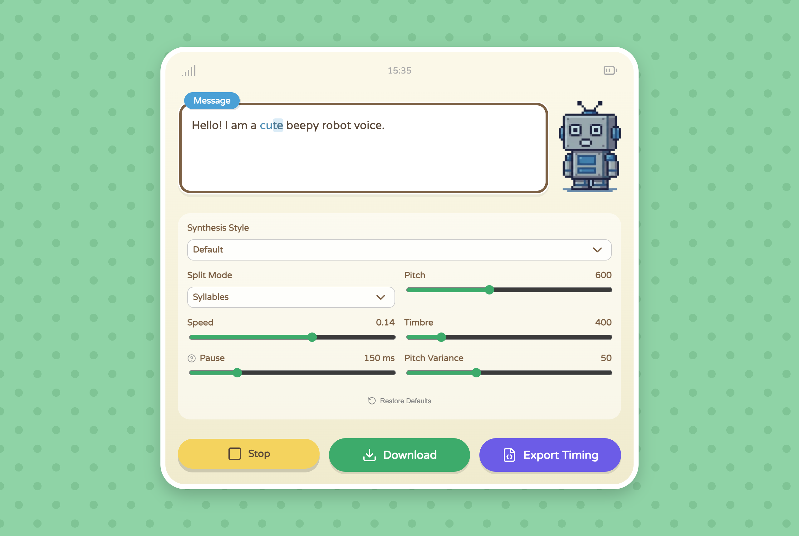
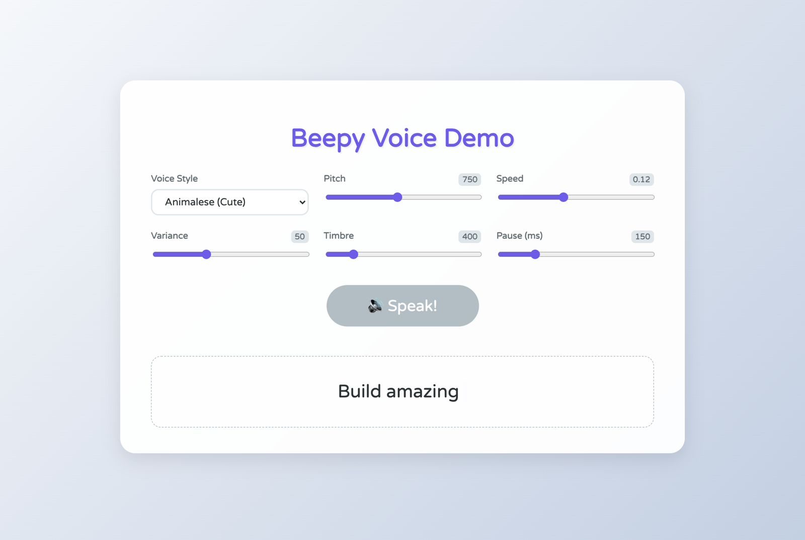

# Beepy Voice Synthesizer

Turn any text into a cute, rhythmic "beepy" voice (Animal Crossing style) right in the browser. Zero dependencies, one script tag, built on the Web Audio API.

- **Live app:** https://stmn.github.io/beepy-voice-synthesizer/
- **API demo:** https://stmn.github.io/beepy-voice-synthesizer/example.html



## Quick start

```html
<button id="speak">Speak</button>

<script src="https://cdn.jsdelivr.net/gh/stmn/beepy-voice-synthesizer@main/src/beepy-voice-synth.js"></script>
<script>
    const synth = BeepyVoiceSynth()
    document.getElementById('speak').onclick = () => synth.speak('Hello world!')
</script>
```

That's it. The audio samples are loaded automatically from the same location as the script.

To self-host, copy the `src/` folder (script + two `.wav` files) into your project and point the script tag at it.

## Options

```js
const synth = BeepyVoiceSynth({
    mode: 'characters',      // voice style, see below
    pitch: 600,              // 200-1200
    speed: 0.14,             // 0.05-0.2
    variance: 50,            // 0-150, how much the pitch jumps around
    timbre: 400,             // 100-2000, muffled to bright
    pause: 150,              // ms of silence after . , ! ?
    splitMode: 'syllables',  // 'syllables' | 'chars' | 'words'
})

synth.setConfig({ pitch: 900 })  // change anything later
```

**Voice styles (`mode`):** `syllables` (default), `characters` (Animalese), `robot`, `demon_sampled`, `retro`, `alien`, `beast`, `chorus`, `crystal`

## API

```js
await synth.speak(text)                    // play the whole text, resolves when done

const parts = synth.karaoke(text)          // one part per syllable / space / punctuation
for (const part of parts) {
    part.text()       // 'Hel'
    part.type()       // 'token' | 'space' | 'punct'
    part.startTime    // seconds
    part.duration     // seconds
    await part.speak()
}

const { duration, timeline } = synth.getTimeline(text)   // timing only, no audio
const buffer = await synth.renderToBuffer(text)          // AudioBuffer, e.g. for WAV export
```

### Karaoke example

```js
const synth = BeepyVoiceSynth({ mode: 'characters' })
const el = document.getElementById('text')

async function sayIt(text) {
    el.textContent = ''
    for (const part of synth.karaoke(text)) {
        el.textContent += part.text()
        await part.speak()
    }
}
```



## Notes

- Browsers require a user gesture (click, key press) before audio can play. Call `speak()` from an event handler.
- With bundlers (`import`/`require`), pass `basePath` pointing to the folder that holds `animalese.wav` and `demon.wav`.

## Credits

Animalese samples and the original synthesis idea come from [animalese.js](https://github.com/Acedio/animalese.js) by [Acedio](https://github.com/Acedio) (MIT).
